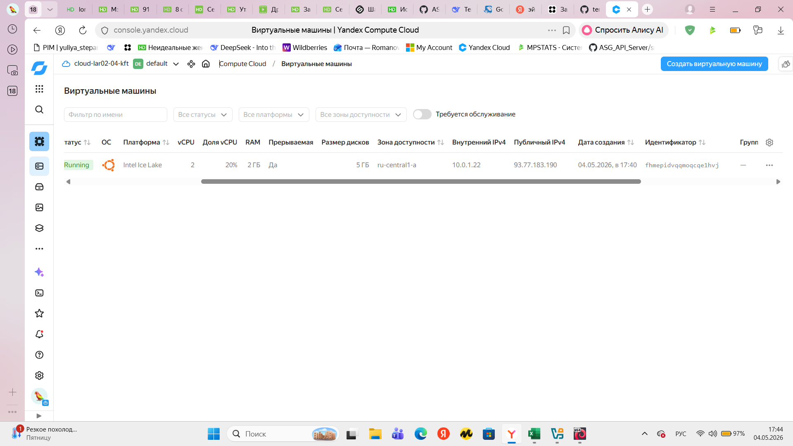
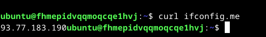
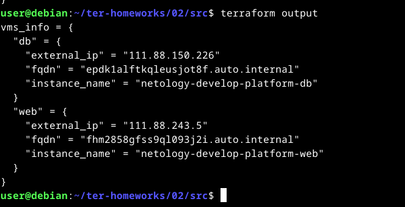

# Домашнее задание к занятию «Основы Terraform. Yandex Cloud»

## Задание 1

### Скриншоты

**Скриншот 1:** Личный кабинет Yandex Cloud с созданной виртуальной машиной (виден внешний IP-адрес)

**Скриншот 2:** Подключение по SSH и `curl ifconfig.me` (IP-адреса совпадают)

### Ответы на вопросы

**1. Какие синтаксические ошибки были в коде?**

В исходном коде были допущены следующие ошибки:
- `platform_id = "standart-v4"` — опечатка в слове `standard` (было `standart`) и неверная версия платформы
- `core_fraction = 5` — для платформы `standard-v3` минимальное значение 20
- `cores = 1` — для платформы `standard-v3` минимальное количество ядер 2
- `memory = 1` — требовалось увеличить до 2

**2. Как могут пригодиться параметры `preemptible = true` и `core_fraction = 5`?**

- `preemptible = true` — делает виртуальную машину прерываемой (в 3–4 раза дешевле). Полезно для тестовых и обучающих сред, а также для пакетных задач, которые можно перезапустить.
- `core_fraction = 5` — гарантированная доля vCPU (5% производительности ядра). Полезно для микросервисов с низкой нагрузкой, а также для экономии ресурсов при обучении.

## Задание 4

**Скриншот 3:** Вывод команды `terraform output`

## Структура проекта

- `main.tf` — основная конфигурация ресурсов
- `variables.tf` — объявление переменных
- `vms_platform.tf` — переменные для ВМ и map-структуры
- `outputs.tf` — выходные данные (IP, FQDN, имена)
- `locals.tf` — локальные переменные для имен ВМ
- `providers.tf` — настройка провайдера Yandex Cloud
- `terraform.tfvars` — значения переменных (cloud_id, folder_id, ресурсы ВМ, metadata)

Все задания (1–6) выполнены, код проходит `terraform plan` без ошибок.
